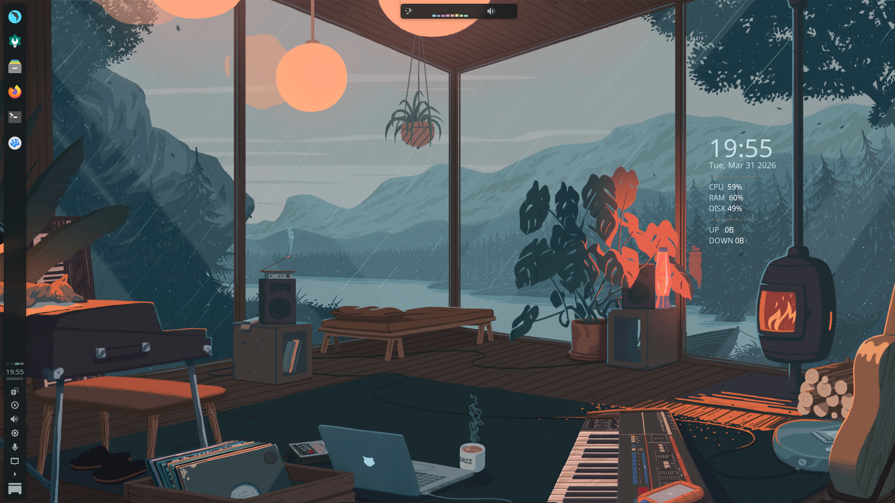
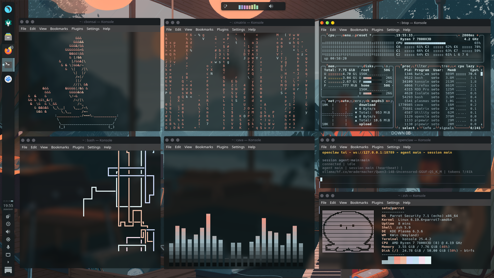
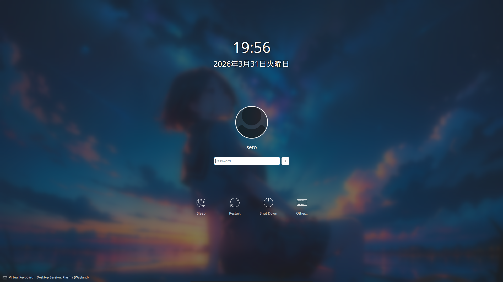

# 🌧️ kosame

**Parrot OS · KDE Plasma 6 · Lofi Rice**

[](https://parrotsec.org/)
[](https://kde.org/plasma-desktop/)
[](LICENSE)
[](https://github.com/KiyoTopKop/dotfiles/stargazers)
[](https://github.com/KiyoTopKop/dotfiles/commits)

*a lofi cabin in the rain — calm, warm, yours*

</div>

---

## 📸 Screenshots

<details open>
<summary><strong>🖥️ Desktop</strong></summary>
<br/>



</details>

<details>
<summary><strong>💻 Terminals</strong></summary>
<br/>



> Showing: `cbonsai` · `cmatrix` · `btop` · `cava` · `openclaw` · `fastfetch`

</details>

<details>
<summary><strong>🔐 Login Screen</strong></summary>
<br/>



</details>

---

## 🎬 Demo

https://youtu.be/t4mccsESksI

> *Full desktop showcase — lofi ambiance, system tools, and terminal workflow*

---

## 🎨 Color Palette

Colors are dynamically extracted from the wallpaper using **kde-material-you-colors**.

| Role | Hex | Preview |
|------|-----|---------|
| Background | `#0a0f10` |  |
| Foreground | `#c8e1e8` |  |
| Teal | `#9ab1b8` |  |
| Salmon | `#f09785` |  |
| Warm | `#ecb69b` |  |
| Blue | `#c9d7fa` |  |
| Cyan | `#bedfed` |  |
| White | `#e0f3f4` |  |

---

## 🛠️ Stack

| Component | Tool |
|-----------|------|
| OS | Parrot Security 7.1 |
| DE | KDE Plasma 6.3 |
| WM | KWin (Wayland) |
| Shell | Zsh + Oh My Zsh |
| Prompt | Starship |
| Terminal | Konsole |
| Fetch | Fastfetch |
| System Monitor | Btop |
| Music Visualizer | Cava |
| Desktop Stats | Conky |
| Icons | Papirus-Dark |
| Qt Style | Kvantum-dark |
| Window Deco | Sweet-Mars |
| Color Engine | kde-material-you-colors |
| Font | JetBrainsMono Nerd Font |
| Browser | Firefox + Tabliss |

---

## ⚡ Installation

### Prerequisites

Make sure you are on **Parrot OS 7.1** (or Debian/Ubuntu-based distro) with **KDE Plasma 6** installed and running.

```bash
# Verify your environment
cat /etc/os-release
plasmashell --version
```

---

### Step 1 — Clone the Repository

```bash
git clone https://github.com/KiyoTopKop/dotfiles.git
cd dotfiles
```

---

### Step 2 — Make the Installer Executable

```bash
chmod +x install.sh
```

---

### Step 3 — Run the Installer

```bash
./install.sh
```

The installer will automatically:

- ✅ Install all system dependencies (`zsh`, `btop`, `conky`, `cmatrix`, `cbonsai`, etc.)
- ✅ Install **Fastfetch** (latest release from GitHub)
- ✅ Install **JetBrainsMono Nerd Font**
- ✅ Install and configure **Oh My Zsh** with plugins
- ✅ Install **Starship** prompt
- ✅ Install **kde-material-you-colors** via `pipx`
- ✅ Build and install **Cava** from source
- ✅ Copy all config files to `~/.config/`
- ✅ Apply KDE settings (icons, blur, effects)
- ✅ Download and set the wallpaper
- ✅ Set **Zsh** as your default shell

---

### Step 4 — Post-Install Steps

After the installer finishes:

```bash
# 1. Log out and log back in (to activate Zsh)
# 2. Start the dynamic color engine
kde-material-you-colors

# 3. (Optional) Apply the Kvantum theme manually
kvantummanager
# → Select "KvDark" or your preferred dark theme → Apply
```

---

### Step 5 — Set Wallpaper (if not auto-applied)

```bash
plasma-apply-wallpaperimage ~/Pictures/Wallpapers/kosame-wall.png
```

Or download it manually:

```bash
wget "https://raw.githubusercontent.com/Hydradevx/Wallpaper-Bank/main/Pastel-Window.png" \
    -O ~/Pictures/Wallpapers/kosame-wall.png
plasma-apply-wallpaperimage ~/Pictures/Wallpapers/kosame-wall.png
```

---

### Manual Install (Without Script)

If you prefer to install configs manually:

```bash
# Copy configs
cp -r .config/cava      ~/.config/
cp -r .config/conky     ~/.config/
cp -r .config/fastfetch ~/.config/
cp -r .config/btop      ~/.config/
cp -r .config/gtk-3.0   ~/.config/
cp -r .config/autostart ~/.config/
cp -r .config/konsole   ~/.config/
cp    .config/starship.toml ~/.config/

# Copy home files
cp home/.zshrc    ~/
cp home/.gtkrc-2.0 ~/
```

---

## 📁 Structure

```
kosame/
├── .config/
│   ├── cava/              # Music visualizer config
│   ├── conky/             # Desktop clock & stats overlay
│   ├── fastfetch/         # System fetch + ASCII art
│   │   └── arts/          # ASCII art collection
│   ├── btop/              # System monitor theme
│   │   └── themes/        # kosame btop theme
│   ├── konsole/           # Terminal profile
│   ├── starship.toml      # Shell prompt config
│   ├── gtk-3.0/           # GTK3 theme
│   └── autostart/         # Autostart services
├── home/
│   ├── .zshrc             # Zsh config + aliases
│   └── .gtkrc-2.0         # GTK2 theme
├── kde/
│   ├── kwinrc.conf        # KWin effects & gaps
│   └── kdeglobals.conf    # KDE global theme
├── wallpapers/            # Wallpaper collection
├── screenshots/           # Screenshots
├── install.sh             # Automated one-line installer
├── LICENSE
└── README.md
```

---

## 🖥️ Terminal Aliases

| Alias | Command | Description |
|-------|---------|-------------|
| `bonsai` | `cbonsai -l` | Render a growing ASCII bonsai tree |
| `matrix` | `cmatrix -C cyan` | Matrix rain animation |
| `music` | `cava` | Launch music visualizer |
| `top` | `btop` | Beautiful system monitor |
| `ll` | `ls -la` | Detailed file listing |

---

## 🔑 KDE Keyboard Shortcuts

| Shortcut | Action |
|----------|--------|
| `Meta + Left / Right` | Snap window to half screen |
| `Meta + Up` | Maximize window |
| `Meta + T` | Open terminal (Konsole) |
| `Meta + R` | KRunner launcher |
| `Print Screen` | Screenshot tool |

---

## ❓ Troubleshooting

**Fonts not rendering correctly?**
```bash
fc-cache -fv
```

**Zsh not set as default after install?**
```bash
chsh -s $(which zsh)
# Then log out and back in
```

**`kde-material-you-colors` not found after install?**
```bash
pipx install kde-material-you-colors --system-site-packages
pipx ensurepath
source ~/.zshrc
```

**Conky not starting?**
```bash
conky -c ~/.config/conky/conky.conf &
```

---

## 🤝 Contributing

Contributions, issues, and feature requests are welcome!

1. **Fork** the repository
2. **Create** a new branch: `git checkout -b my-feature`
3. **Commit** your changes: `git commit -m "add: my feature"`
4. **Push** to the branch: `git push origin my-feature`
5. **Open a Pull Request**

---


⭐ Star this repo if it helped you!

</div>
